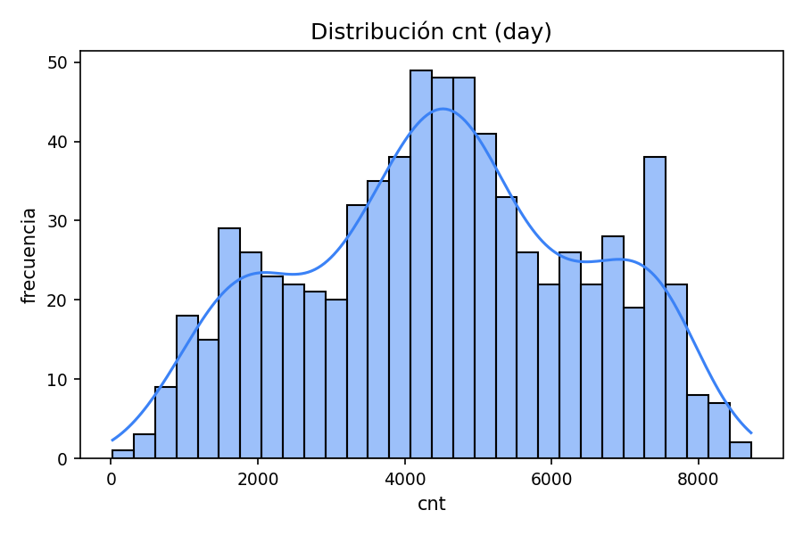
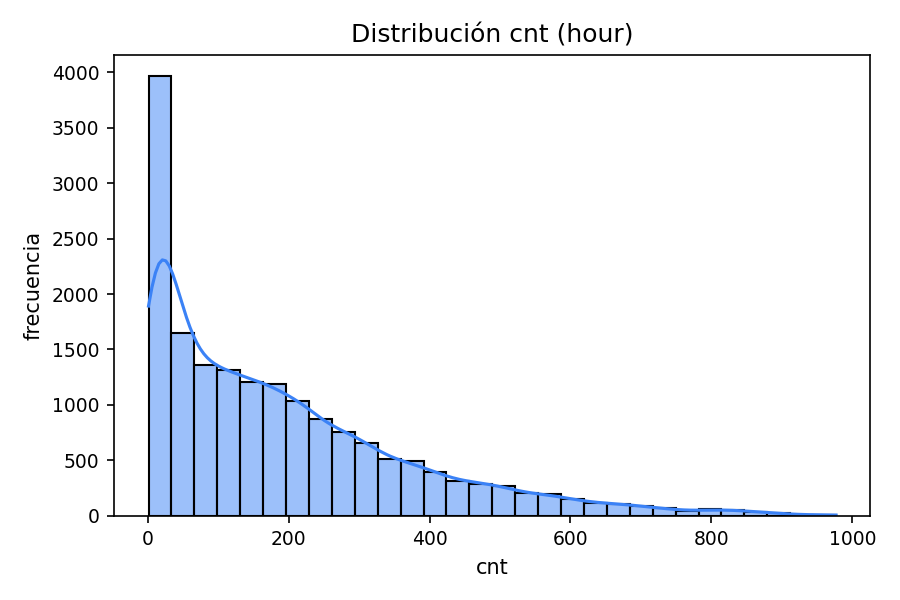
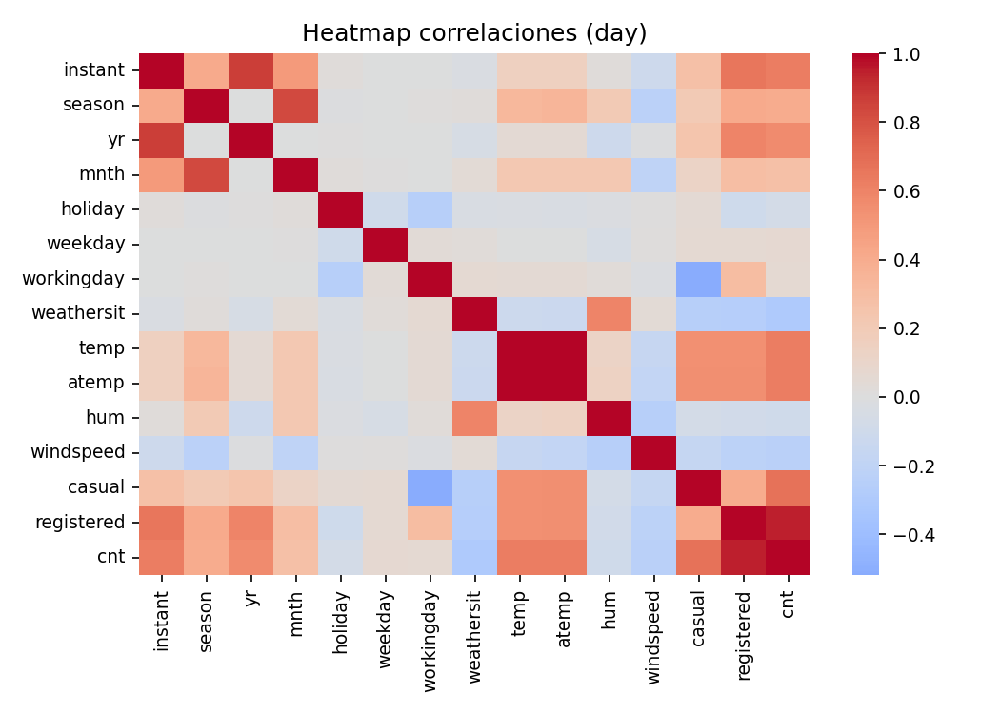
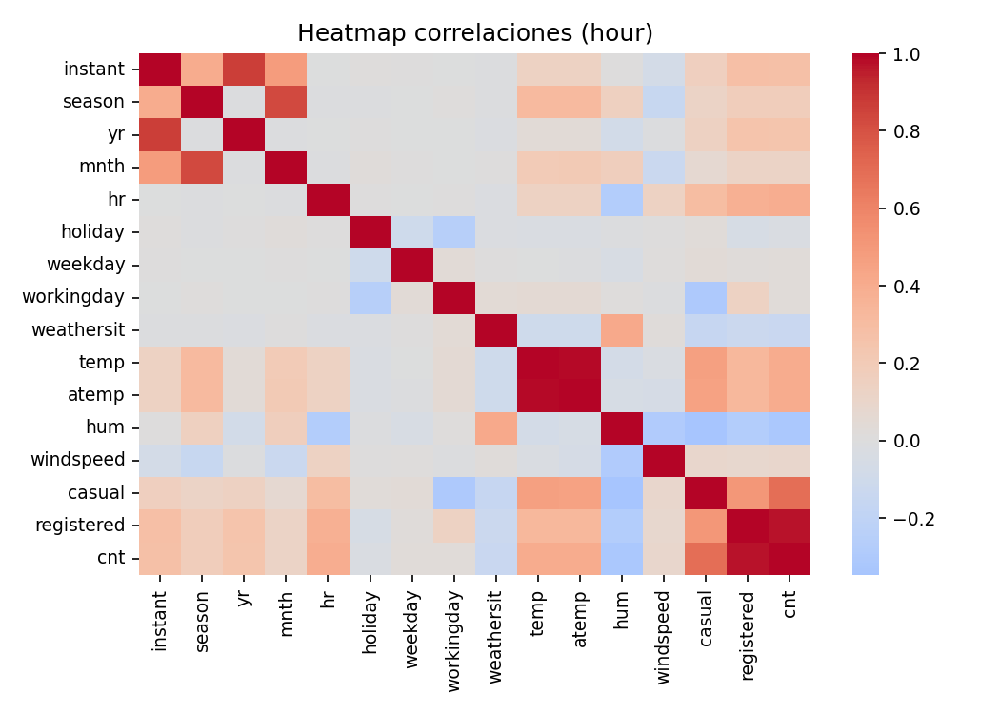

# Análisis descriptivo Bike Sharing

Variable respuesta: `cnt`.

## Perfil dataset (day)
Filas: 731 | Columnas: 16

### Tipos de datos
|            | dtype          |
|:-----------|:---------------|
| instant    | int64          |
| dteday     | datetime64[ns] |
| season     | int64          |
| yr         | int64          |
| mnth       | int64          |
| holiday    | int64          |
| weekday    | int64          |
| workingday | int64          |
| weathersit | int64          |
| temp       | float64        |
| atemp      | float64        |
| hum        | float64        |
| windspeed  | float64        |
| casual     | int64          |
| registered | int64          |
| cnt        | int64          |

### Valores faltantes (conteo)
|            |   missing |
|:-----------|----------:|
| instant    |         0 |
| dteday     |         0 |
| season     |         0 |
| yr         |         0 |
| mnth       |         0 |
| holiday    |         0 |
| weekday    |         0 |
| workingday |         0 |
| weathersit |         0 |
| temp       |         0 |
| atemp      |         0 |
| hum        |         0 |
| windspeed  |         0 |
| casual     |         0 |
| registered |         0 |
| cnt        |         0 |

### Estadísticos (numéricos)
|            |   count |         mean |          std |        min |         25% |         50% |         75% |         max |
|:-----------|--------:|-------------:|-------------:|-----------:|------------:|------------:|------------:|------------:|
| instant    |     731 |  366         |  211.166     |  1         |  183.5      |  366        |  548.5      |  731        |
| season     |     731 |    2.49658   |    1.11081   |  1         |    2        |    3        |    3        |    4        |
| yr         |     731 |    0.500684  |    0.500342  |  0         |    0        |    1        |    1        |    1        |
| mnth       |     731 |    6.51984   |    3.45191   |  1         |    4        |    7        |   10        |   12        |
| holiday    |     731 |    0.0287278 |    0.167155  |  0         |    0        |    0        |    0        |    1        |
| weekday    |     731 |    2.99726   |    2.00479   |  0         |    1        |    3        |    5        |    6        |
| workingday |     731 |    0.683995  |    0.465233  |  0         |    0        |    1        |    1        |    1        |
| weathersit |     731 |    1.39535   |    0.544894  |  1         |    1        |    1        |    2        |    3        |
| temp       |     731 |    0.495385  |    0.183051  |  0.0591304 |    0.337083 |    0.498333 |    0.655417 |    0.861667 |
| atemp      |     731 |    0.474354  |    0.162961  |  0.0790696 |    0.337842 |    0.486733 |    0.608602 |    0.840896 |
| hum        |     731 |    0.627894  |    0.142429  |  0         |    0.52     |    0.626667 |    0.730209 |    0.9725   |
| windspeed  |     731 |    0.190486  |    0.0774979 |  0.0223917 |    0.13495  |    0.180975 |    0.233214 |    0.507463 |
| casual     |     731 |  848.176     |  686.622     |  2         |  315.5      |  713        | 1096        | 3410        |
| registered |     731 | 3656.17      | 1560.26      | 20         | 2497        | 3662        | 4776.5      | 6946        |
| cnt        |     731 | 4504.35      | 1937.21      | 22         | 3152        | 4548        | 5956        | 8714        |

## Perfil dataset (hour)
Filas: 17379 | Columnas: 17

### Tipos de datos
|            | dtype          |
|:-----------|:---------------|
| instant    | int64          |
| dteday     | datetime64[ns] |
| season     | int64          |
| yr         | int64          |
| mnth       | int64          |
| hr         | int64          |
| holiday    | int64          |
| weekday    | int64          |
| workingday | int64          |
| weathersit | int64          |
| temp       | float64        |
| atemp      | float64        |
| hum        | float64        |
| windspeed  | float64        |
| casual     | int64          |
| registered | int64          |
| cnt        | int64          |

### Valores faltantes (conteo)
|            |   missing |
|:-----------|----------:|
| instant    |         0 |
| dteday     |         0 |
| season     |         0 |
| yr         |         0 |
| mnth       |         0 |
| hr         |         0 |
| holiday    |         0 |
| weekday    |         0 |
| workingday |         0 |
| weathersit |         0 |
| temp       |         0 |
| atemp      |         0 |
| hum        |         0 |
| windspeed  |         0 |
| casual     |         0 |
| registered |         0 |
| cnt        |         0 |

### Estadísticos (numéricos)
|            |   count |         mean |         std |   min |       25% |       50% |        75% |        max |
|:-----------|--------:|-------------:|------------:|------:|----------:|----------:|-----------:|-----------:|
| instant    |   17379 | 8690         | 5017.03     |  1    | 4345.5    | 8690      | 13034.5    | 17379      |
| season     |   17379 |    2.50164   |    1.10692  |  1    |    2      |    3      |     3      |     4      |
| yr         |   17379 |    0.502561  |    0.500008 |  0    |    0      |    1      |     1      |     1      |
| mnth       |   17379 |    6.53778   |    3.43878  |  1    |    4      |    7      |    10      |    12      |
| hr         |   17379 |   11.5468    |    6.91441  |  0    |    6      |   12      |    18      |    23      |
| holiday    |   17379 |    0.0287704 |    0.167165 |  0    |    0      |    0      |     0      |     1      |
| weekday    |   17379 |    3.00368   |    2.00577  |  0    |    1      |    3      |     5      |     6      |
| workingday |   17379 |    0.682721  |    0.465431 |  0    |    0      |    1      |     1      |     1      |
| weathersit |   17379 |    1.42528   |    0.639357 |  1    |    1      |    1      |     2      |     4      |
| temp       |   17379 |    0.496987  |    0.192556 |  0.02 |    0.34   |    0.5    |     0.66   |     1      |
| atemp      |   17379 |    0.475775  |    0.17185  |  0    |    0.3333 |    0.4848 |     0.6212 |     1      |
| hum        |   17379 |    0.627229  |    0.19293  |  0    |    0.48   |    0.63   |     0.78   |     1      |
| windspeed  |   17379 |    0.190098  |    0.12234  |  0    |    0.1045 |    0.194  |     0.2537 |     0.8507 |
| casual     |   17379 |   35.6762    |   49.305    |  0    |    4      |   17      |    48      |   367      |
| registered |   17379 |  153.787     |  151.357    |  0    |   34      |  115      |   220      |   886      |
| cnt        |   17379 |  189.463     |  181.388    |  1    |   40      |  142      |   281      |   977      |

## Correlaciones más altas con `cnt` (day)
|            |   pearson |   pearson_abs |
|:-----------|----------:|--------------:|
| registered |  0.945517 |      0.945517 |
| casual     |  0.672804 |      0.672804 |
| atemp      |  0.631066 |      0.631066 |
| instant    |  0.62883  |      0.62883  |
| temp       |  0.627494 |      0.627494 |
| yr         |  0.56671  |      0.56671  |
| season     |  0.4061   |      0.4061   |
| weathersit | -0.297391 |      0.297391 |

## Correlaciones más altas con `cnt` (hour)
|            |   pearson |   pearson_abs |
|:-----------|----------:|--------------:|
| registered |  0.972151 |      0.972151 |
| casual     |  0.694564 |      0.694564 |
| temp       |  0.404772 |      0.404772 |
| atemp      |  0.400929 |      0.400929 |
| hr         |  0.394071 |      0.394071 |
| hum        | -0.322911 |      0.322911 |
| instant    |  0.278379 |      0.278379 |
| yr         |  0.250495 |      0.250495 |

## Figuras

## Conjuntos de modelización y validación
Se realizó un split temporal 80/20 por `dteday` para ambos datasets.